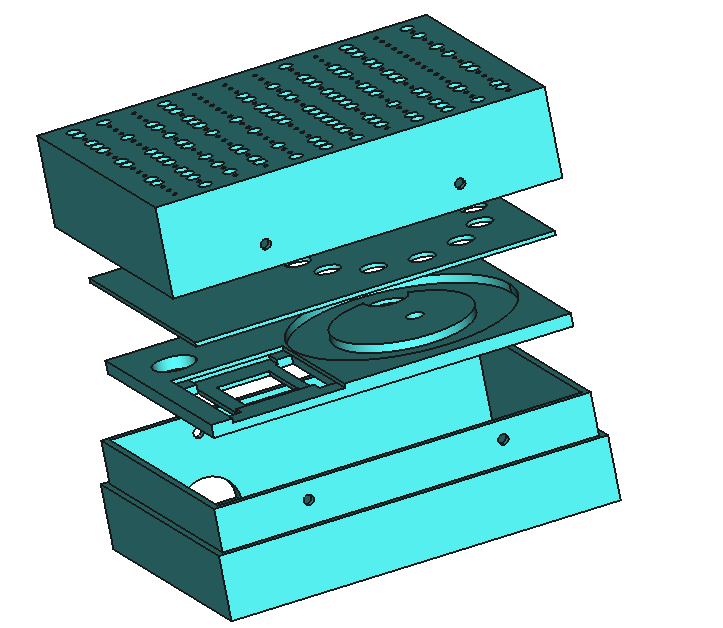

# Wemos "MQTT Mini"

This is a minimalist sensor designed for low cost. It uses a Wemos D1 Mini as the processor, a cheaper ZPH01 dust sensor, a BME280 environmental sensor and a neopixel ring for the output.

NOTE THAT THIS SOFTWARE HAS BEEN SUPERCEEDED BY THE MONITAIR SOFTWARE

The connections to the Wemos are as follows (the D values are the pins as labelled on the Wemos device itself)

| Function   |   Wemos Pin    |  Arduino Pin | Source File |
| ----------:|-------------:|-------------:|-------------:|
| I2c SCL    |D1|GPIO5|Wemos default
| I2c SDA   |D2|GPIO4|Wemos default
| Power control|D4|GPIO2|power.h
| Config switch|D5|GPIO14|shared.h
| Air Quality sensor serial RX|D6|GPIO12|shared.h
| GPS Receiver serial RX|D7|GPIO13|shared.h
| NeoPixel control|D8|GPIO15|PixelControl.h

## Notes

The current revision of the software uses SoftwareSerial for both the GPS receiver and the Air Quality sensor. This has been observed to cause problems with random resets which are being investigated.

The software makes use of the ezTime, MicroNMEA and Adafruit NeoPixel libraries, along with the tools for the ESP8266 processor type. 

## The configuration switch

The confiiguration switch should be connected between the indicated GPIO pin and ground. When the switch is closed the sensor will display status information. If the device is powered on with the confguration switch held closed it will enter access point configuration mode (see later)

## Status information

Sensor status information is displayed for 20 seconds after power on and whenver the configuration switch is closed. The device will display a number of red or blue dots with the following meanings:

| Display            |      Meaning                                |
| ------------------:|---------------------------------------------------:|
| One blue dot| WiFi Starting |
| Two blue dots | WiFi Scanning for access points |
| Three blue dots | WiFi Connecting to an access point |
| Four blue dots | WiFi Connected |
| Five blue dots | Connecting to MQTT server |
| Six blue dots | Connected to MQTT server |
| One red dot | WiFi connection failed |
| Two red dots | MQTT connection failed |
| One magenta dot| WiFi setup awaiting clients |
| Two magenta dots | WiFi setup client connected |
| Three magenta dots | WiFi setup processing response from client |
| Four magenta dots | WiFi setup complete - please reboot the device |

## Access Point Configuration Mode

When in access point configuration mode the device will function as a WiFi access point. A WiFi client can connect to this access point and enter configuration information onto a web form. When the web form is submitted to the device the settings are validated and stored within the device which can then be rebooted (turned off and on again) to activate the new settings. 

To connect to the device, use your PC, Smartphone or tablet to find a local access point with a name that starts "MQTTmini". Connect to this and then browse to "http://192.168.4.1". A web form is displayed in which you can set the WiFi and MQTT configuration for the device. Press the submit button on the form to submit the form and store the settings. 

